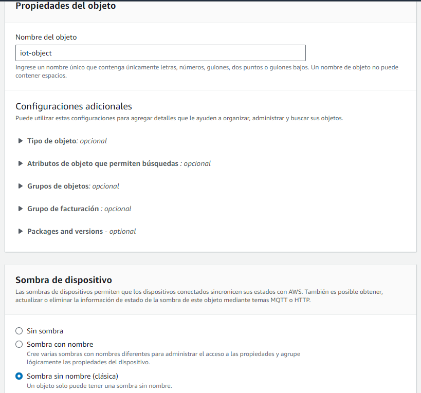
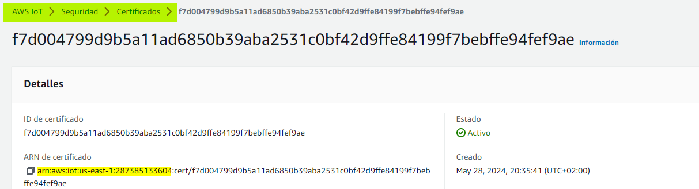
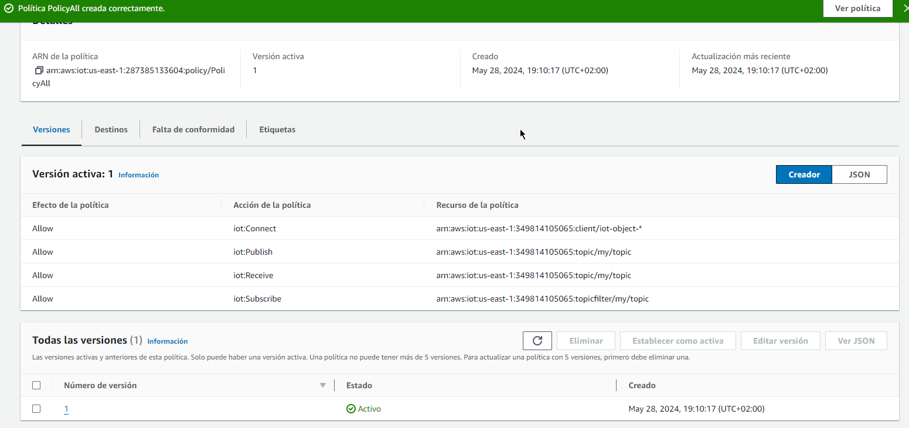
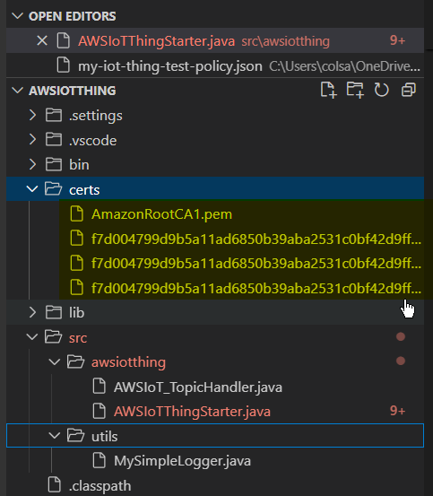
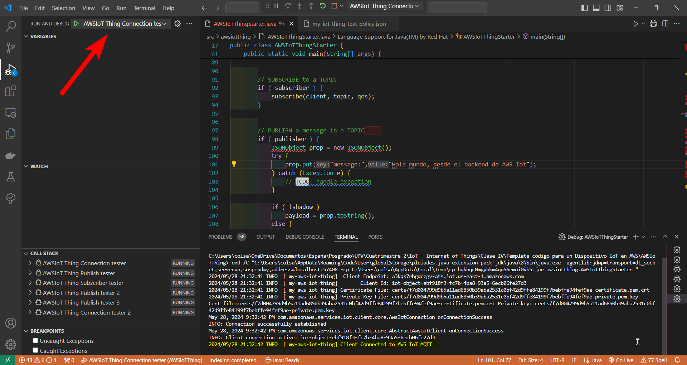
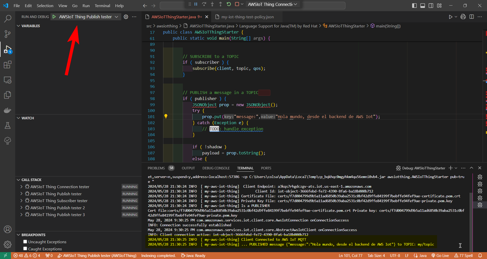
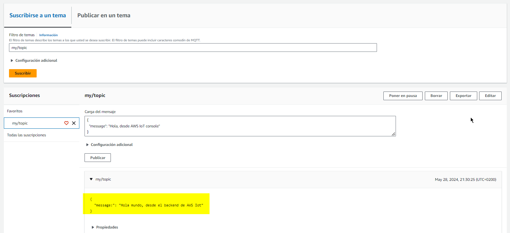
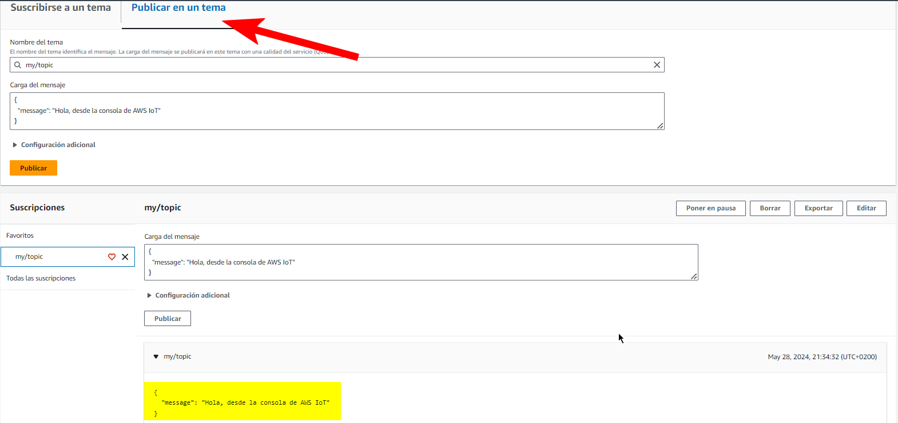
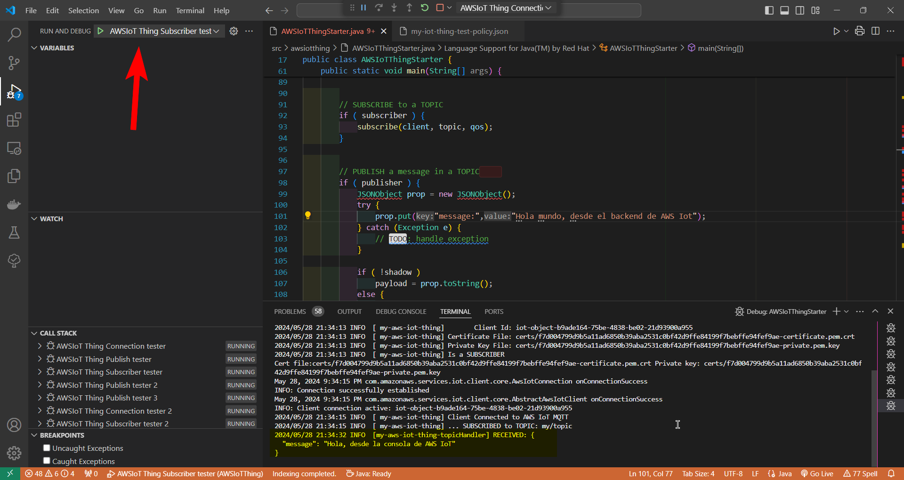

**AWS IoT**
1. Ingresar a AWS Academy, luego lanzar el lab e ingresar a AWS Console.
2. Buscar el servicio AWS IOT
3. Administrar>Objetos>Crear Objetos
4. Evidencia



5. Generar automaticamente un certificado
Se asocia el certificado a la politica (que ya previamente habia creado y que se enseña en el punto 6) y se descarga la información.

6. Montar la politica
*NOTA:* Para el campo Resource, el primer segmento de información se obtiene de: 



```
{
  "Version": "2012-10-17",
  "Statement": [
    {
      "Effect": "Allow",
      "Action": "iot:Connect",
      "Resource": "arn:aws:iot:us-east-1:349814105065:client/iot-thing-*"
    },
    {
      "Effect": "Allow",
      "Action": "iot:Publish",
      "Resource": "arn:aws:iot:us-east-1:349814105065:topic/my/topic"
    },
    {
      "Effect": "Allow",
      "Action": "iot:Receive",
      "Resource": [
        "arn:aws:iot:us-east-1:349814105065:topic/my/topic"
      ]
    },
    {
      "Effect": "Allow",
      "Action": "iot:Subscribe",
      "Resource": [
        "arn:aws:iot:us-east-1:349814105065:topicfilter/my/topic"
      ]
    }
  ]
}
```


7. Obtener el endpoint
AWS IoT>Configuraciones
🔗_a3kqs7rhgdczgv-ats.iot.us-east-1.amazonaws.com​_

8. Se agrega el codigo de VS la información del certificado descargados.



9. Pruebas de conexión


10. Prueba de publicación
*NOTA:* Se debe crear una nuvea conexion de MQTT para que funcione. MQTT no permite multiples conexiones.




11. Prueba de suscripción


